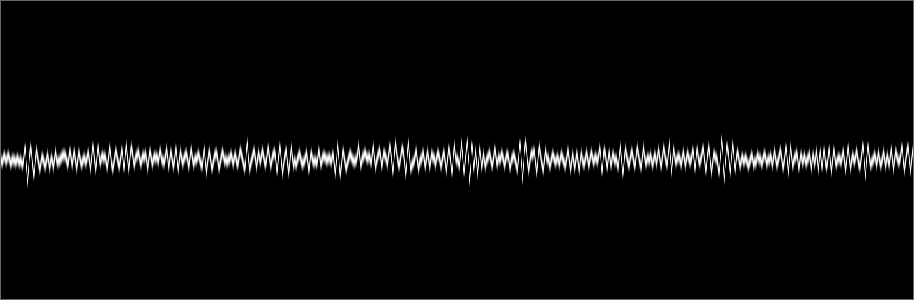

# Loopback Visualizer

Real-time audio oscilloscope visualization using OpenGL that captures audio from your system's output device and renders it as a smooth waveform display. Works with any audio playback source.

## Features

- **Cross-platform support**: Windows (WASAPI) and Linux (PulseAudio) backends
- **Real-time visualization**: GPU-accelerated waveform rendering with phase-locked display
- **System audio capture**: Monitors default output device (loopback recording)
- **Smooth rendering**: 4x sample interpolation and anti-aliased line drawing
- **Audio processing**: Built-in filtering and FFT capabilities via metaFFT

## Requirements

- CMake 3.13+
- C++14 compiler
- OpenGL 3.3+ support
- Audio system: WASAPI (Windows) or PulseAudio (Linux)
- [Task](https://taskfile.dev) (optional, for simplified build commands)

## Building

### Using Task (recommended)
Install Task first:
- Arch Linux: `sudo pacman -S go-task` (binary is `go-task`)
- Install script: `sh -c "$(curl --location https://taskfile.dev/install.sh)" -- -d`
- Other platforms: https://taskfile.dev/installation/

```bash
go-task run    # Build and run (use 'task' if installed via script)
go-task build  # Just build
go-task clean  # Clean build artifacts
```

### Manual build
```bash
mkdir build && cd build
cmake ..
make
./visualizer
```

The visualizer will automatically detect and use your system's default audio output device.

## Limitations

- Does not work with applications using exclusive audio mode
- Requires audio playback to be active for visualization

Note: The GIF below doesn't show the full fluidity of the actual application

