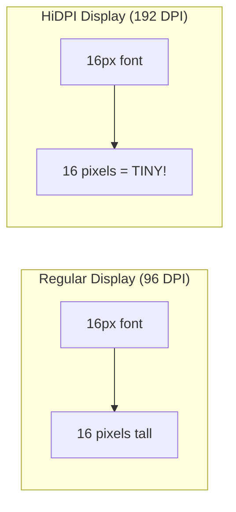

# HiDPI & Scaling Guide

## The HiDPI Problem

Modern displays have high pixel densities (4K, Retina, etc.). Without proper handling:
- Text appears tiny and unreadable
- UI elements are too small to click
- The interface looks cramped



## Understanding DPI Scaling

### Key Concepts

1. **Physical DPI**: Actual pixels per inch on the display
2. **Logical DPI**: OS-reported DPI for UI scaling
3. **Scale Factor**: Ratio between physical and logical pixels
4. **Content Scale**: GLFW's reported UI scale

### Platform Differences

| Platform | Scale Detection | Typical Values |
|----------|----------------|----------------|
| Windows  | Per-monitor DPI | 100%, 125%, 150%, 200% |
| macOS    | Retina displays | 1x or 2x |
| Linux    | Variable (Wayland/X11) | 1x, 1.25x, 1.5x, 2x |

## Implementation Strategy

### Step 1: Detect Display Scale

```cpp
float getDisplayScale(GLFWwindow* window) {
    // Method 1: GLFW content scale (recommended)
    float xscale, yscale;
    glfwGetWindowContentScale(window, &xscale, &yscale);
    return xscale;  // Usually xscale == yscale
    
    // Method 2: Manual calculation
    // int width_mm, height_mm;
    // GLFWmonitor* monitor = glfwGetPrimaryMonitor();
    // glfwGetMonitorPhysicalSize(monitor, &width_mm, &height_mm);
    // const GLFWvidmode* mode = glfwGetVideoMode(monitor);
    // float dpi = mode->width / (width_mm / 25.4f);
    // return dpi / 96.0f;  // 96 DPI is "standard"
}
```

### Step 2: Scale Fonts Properly

```cpp
class FontManager {
private:
    float base_size = 16.0f;
    float scale_factor = 1.0f;
    
public:
    void loadFonts(float display_scale) {
        scale_factor = display_scale;
        ImGuiIO& io = ImGui::GetIO();
        io.Fonts->Clear();
        
        // Load fonts at scaled size
        float scaled_size = base_size * scale_factor;
        
        // Regular font
        ImFont* font_regular = io.Fonts->AddFontFromFileTTF(
            "fonts/Roboto-Regular.ttf", scaled_size);
            
        // Bold font
        ImFont* font_bold = io.Fonts->AddFontFromFileTTF(
            "fonts/Roboto-Bold.ttf", scaled_size);
            
        // Monospace for code
        ImFont* font_mono = io.Fonts->AddFontFromFileTTF(
            "fonts/RobotoMono-Regular.ttf", scaled_size * 0.9f);
            
        // Large headers
        ImFont* font_header = io.Fonts->AddFontFromFileTTF(
            "fonts/Roboto-Bold.ttf", scaled_size * 1.5f);
            
        // Rebuild font atlas
        io.Fonts->Build();
    }
    
    float getScaledSize(float size) {
        return size * scale_factor;
    }
};
```

### Step 3: Scale UI Elements

```cpp
void scaleUI(float scale) {
    ImGuiStyle& style = ImGui::GetStyle();
    
    // Scale all sizes
    style.WindowPadding = ImVec2(8.0f * scale, 8.0f * scale);
    style.FramePadding = ImVec2(4.0f * scale, 3.0f * scale);
    style.ItemSpacing = ImVec2(8.0f * scale, 4.0f * scale);
    style.ItemInnerSpacing = ImVec2(4.0f * scale, 4.0f * scale);
    style.TouchExtraPadding = ImVec2(0.0f, 0.0f);
    style.IndentSpacing = 21.0f * scale;
    style.ScrollbarSize = 14.0f * scale;
    style.GrabMinSize = 10.0f * scale;
    
    // Scale borders and rounding
    style.WindowBorderSize = 1.0f * scale;
    style.ChildBorderSize = 1.0f * scale;
    style.PopupBorderSize = 1.0f * scale;
    style.FrameBorderSize = 0.0f;
    style.TabBorderSize = 0.0f;
    
    style.WindowRounding = 4.0f * scale;
    style.ChildRounding = 4.0f * scale;
    style.FrameRounding = 2.0f * scale;
    style.PopupRounding = 4.0f * scale;
    style.ScrollbarRounding = 9.0f * scale;
    style.GrabRounding = 2.0f * scale;
    style.TabRounding = 4.0f * scale;
}
```

### Step 4: Handle Dynamic Scale Changes

```cpp
class HiDPIManager {
private:
    GLFWwindow* window;
    float current_scale = 1.0f;
    FontManager fonts;
    
public:
    HiDPIManager(GLFWwindow* win) : window(win) {
        updateScale();
        
        // Monitor scale changes
        glfwSetWindowContentScaleCallback(window, 
            [](GLFWwindow* window, float xscale, float yscale) {
                auto* mgr = static_cast<HiDPIManager*>(
                    glfwGetWindowUserPointer(window));
                mgr->onScaleChanged(xscale);
            });
        glfwSetWindowUserPointer(window, this);
    }
    
    void updateScale() {
        float xscale, yscale;
        glfwGetWindowContentScale(window, &xscale, &yscale);
        
        if (std::abs(xscale - current_scale) > 0.001f) {
            current_scale = xscale;
            applyScale();
        }
    }
    
    void applyScale() {
        // Reload fonts
        fonts.loadFonts(current_scale);
        
        // Scale UI
        scaleUI(current_scale);
        
        // Update ImGui
        ImGuiIO& io = ImGui::GetIO();
        io.FontGlobalScale = 1.0f;  // We scale fonts directly
    }
    
    void onScaleChanged(float new_scale) {
        current_scale = new_scale;
        applyScale();
    }
    
    float scale() const { return current_scale; }
};
```

## Complete Example

```cpp
class Application {
private:
    GLFWwindow* window;
    std::unique_ptr<HiDPIManager> hidpi;
    
public:
    void init() {
        // Create window with HiDPI awareness
        glfwWindowHint(GLFW_SCALE_TO_MONITOR, GLFW_TRUE);
        window = glfwCreateWindow(1280, 720, "HiDPI App", NULL, NULL);
        
        // Initialize HiDPI manager
        hidpi = std::make_unique<HiDPIManager>(window);
        
        // Setup ImGui with proper scaling
        setupImGui();
    }
    
    void setupImGui() {
        ImGui::CreateContext();
        ImGuiIO& io = ImGui::GetIO();
        
        // Enable HiDPI flags
        io.ConfigFlags |= ImGuiConfigFlags_DpiEnableScaleFonts;
        io.ConfigFlags |= ImGuiConfigFlags_DpiEnableScaleViewports;
        
        // Let HiDPIManager handle the rest
        hidpi->applyScale();
    }
    
    void render() {
        // Check for scale changes
        hidpi->updateScale();
        
        // Scale-aware rendering
        float scale = hidpi->scale();
        
        ImGui::Begin("Scaled Window");
        
        // Use scaled values for custom drawing
        ImDrawList* draw_list = ImGui::GetWindowDrawList();
        float line_thickness = 2.0f * scale;
        draw_list->AddLine(p1, p2, color, line_thickness);
        
        // Scaled spacing
        ImGui::Dummy(ImVec2(0, 10 * scale));
        
        ImGui::End();
    }
};
```

## Platform-Specific Considerations

### Windows
```cpp
// Enable per-monitor DPI awareness
#ifdef _WIN32
#include <windows.h>
// Call before creating window
SetProcessDpiAwarenessContext(DPI_AWARENESS_CONTEXT_PER_MONITOR_AWARE_V2);
#endif
```

### macOS
```cpp
// Retina support is automatic with GLFW
// Just use content scale
```

### Linux
```cpp
// Check for GDK_SCALE environment variable
const char* gdk_scale = std::getenv("GDK_SCALE");
if (gdk_scale) {
    float scale = std::stof(gdk_scale);
    // Use as fallback if GLFW doesn't report
}
```

## Best Practices

### DO:
- ✅ Load fonts at the correct pixel size
- ✅ Scale all UI metrics (padding, spacing, etc.)
- ✅ Test on different DPI settings
- ✅ Handle dynamic scale changes
- ✅ Use vector icons when possible

### DON'T:
- ❌ Use `FontGlobalScale` as primary solution
- ❌ Hardcode pixel values
- ❌ Assume 96 DPI everywhere
- ❌ Ignore platform differences
- ❌ Scale already-scaled values

## Testing HiDPI

### Windows
```bash
# Change display scaling in Settings > Display
# Test at 100%, 125%, 150%, 200%
```

### Linux
```bash
# Test different scales
GDK_SCALE=2 ./your_app
QT_SCALE_FACTOR=1.5 ./your_app
```

### Development Tips
```cpp
// Add debug UI for testing
if (ImGui::Begin("DPI Debug")) {
    ImGui::Text("Current Scale: %.2f", hidpi->scale());
    
    if (ImGui::Button("Test 1x")) hidpi->applyScale(1.0f);
    if (ImGui::Button("Test 1.5x")) hidpi->applyScale(1.5f);
    if (ImGui::Button("Test 2x")) hidpi->applyScale(2.0f);
}
ImGui::End();
```

## Common Issues

### Blurry Text
```cpp
// Solution: Ensure font size matches scale
float font_size = 16.0f * scale;  // Not 16.0f with FontGlobalScale
```

### Misaligned Custom Drawing
```cpp
// Solution: Scale your coordinates
ImVec2 scaled_pos(pos.x * scale, pos.y * scale);
```

### Window Size Issues
```cpp
// Solution: Distinguish logical vs physical size
int width, height;  // Logical (for ImGui)
glfwGetWindowSize(window, &width, &height);

int fb_width, fb_height;  // Physical (for OpenGL)
glfwGetFramebufferSize(window, &fb_width, &fb_height);
```

## Next Steps

- [Input Handling →](input-handling.md) - Mouse and keyboard with scaling
- [Styling Guide →](styling-guide.md) - Make it beautiful at any DPI