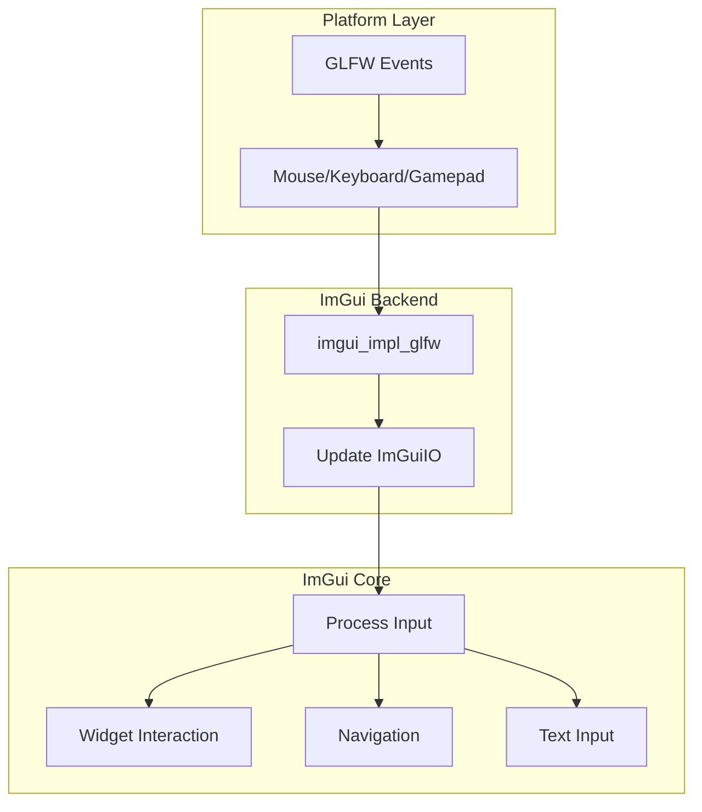

# Input Handling in ImGui

## Input Architecture

ImGui handles input through a unified system that abstracts platform differences:



## Mouse Input

### Basic Mouse Interaction

```cpp
// Get mouse state
ImGuiIO& io = ImGui::GetIO();
ImVec2 mouse_pos = io.MousePos;
bool left_clicked = ImGui::IsMouseClicked(0);
bool right_clicked = ImGui::IsMouseClicked(1);
bool middle_clicked = ImGui::IsMouseClicked(2);

// Mouse in window
if (ImGui::IsWindowHovered()) {
    if (ImGui::IsMouseClicked(0)) {
        // Clicked in this window
    }
}

// Custom click detection
if (ImGui::InvisibleButton("canvas", canvas_size)) {
    ImVec2 click_pos = ImGui::GetMousePos();
    handleCanvasClick(click_pos);
}
```

### Drag Operations

```cpp
// Simple drag
static ImVec2 object_pos(100, 100);
ImGui::SetCursorPos(object_pos);
ImGui::Button("Drag me");
if (ImGui::IsItemActive() && ImGui::IsMouseDragging(0)) {
    object_pos.x += io.MouseDelta.x;
    object_pos.y += io.MouseDelta.y;
}

// Drag with threshold
if (ImGui::IsMouseDragging(0, 5.0f)) {  // 5 pixel threshold
    // User is definitely dragging, not just clicking
}

// Drag values
static float value = 0.0f;
ImGui::DragFloat("Value", &value, 0.1f, 0.0f, 100.0f);

// Custom drag behavior
if (ImGui::BeginDragDropSource()) {
    MyData* data = getCurrentData();
    ImGui::SetDragDropPayload("MY_DATA", data, sizeof(MyData));
    ImGui::Text("Dragging: %s", data->name);
    ImGui::EndDragDropSource();
}
```

### Mouse Wheel

```cpp
// Vertical scroll
float wheel = io.MouseWheel;
if (wheel != 0.0f && ImGui::IsWindowHovered()) {
    zoom_level *= 1.0f + wheel * 0.1f;
}

// Horizontal scroll (shift+wheel on most platforms)
float wheel_h = io.MouseWheelH;

// Custom scroll handling
if (ImGui::IsItemHovered()) {
    if (io.MouseWheel > 0) zoom_in();
    if (io.MouseWheel < 0) zoom_out();
}
```

### Advanced Mouse Patterns

```cpp
class InteractiveCanvas {
private:
    ImVec2 pan_offset = ImVec2(0, 0);
    float zoom = 1.0f;
    bool is_panning = false;
    
public:
    void update() {
        ImDrawList* draw_list = ImGui::GetWindowDrawList();
        ImVec2 canvas_pos = ImGui::GetCursorScreenPos();
        ImVec2 canvas_size = ImGui::GetContentRegionAvail();
        
        // Invisible button for interaction
        ImGui::InvisibleButton("canvas", canvas_size, 
            ImGuiButtonFlags_MouseButtonLeft | 
            ImGuiButtonFlags_MouseButtonRight | 
            ImGuiButtonFlags_MouseButtonMiddle);
            
        const bool is_hovered = ImGui::IsItemHovered();
        const bool is_active = ImGui::IsItemActive();
        
        // Pan with middle mouse
        if (is_hovered && ImGui::IsMouseClicked(2)) {
            is_panning = true;
        }
        if (is_panning) {
            if (ImGui::IsMouseDragging(2)) {
                pan_offset.x += io.MouseDelta.x;
                pan_offset.y += io.MouseDelta.y;
            }
            if (ImGui::IsMouseReleased(2)) {
                is_panning = false;
            }
        }
        
        // Zoom with wheel
        if (is_hovered && io.MouseWheel != 0.0f) {
            // Zoom towards mouse position
            ImVec2 mouse_pos = io.MousePos;
            ImVec2 mouse_canvas = ImVec2(
                (mouse_pos.x - canvas_pos.x - pan_offset.x) / zoom,
                (mouse_pos.y - canvas_pos.y - pan_offset.y) / zoom
            );
            
            float old_zoom = zoom;
            zoom *= 1.0f + io.MouseWheel * 0.1f;
            zoom = ImClamp(zoom, 0.1f, 10.0f);
            
            // Adjust pan to keep mouse position stable
            pan_offset.x += mouse_canvas.x * (old_zoom - zoom);
            pan_offset.y += mouse_canvas.y * (old_zoom - zoom);
        }
        
        // Draw with transform
        draw_list->PushClipRect(canvas_pos, 
            ImVec2(canvas_pos.x + canvas_size.x, 
                   canvas_pos.y + canvas_size.y), true);
                   
        // Apply transform to drawing
        auto transform = [&](ImVec2 p) {
            return ImVec2(
                canvas_pos.x + pan_offset.x + p.x * zoom,
                canvas_pos.y + pan_offset.y + p.y * zoom
            );
        };
        
        // Draw content with transform
        draw_list->AddLine(
            transform(ImVec2(0, 0)), 
            transform(ImVec2(100, 100)), 
            IM_COL32(255, 255, 0, 255), 
            2.0f * zoom);
            
        draw_list->PopClipRect();
    }
};
```

## Keyboard Input

### Basic Key Detection

```cpp
// Check key states
if (ImGui::IsKeyPressed(ImGuiKey_Space)) {
    togglePlayback();
}

// With modifiers
if (ImGui::IsKeyPressed(ImGuiKey_S) && io.KeyCtrl) {
    saveFile();  // Ctrl+S
}

// Key combinations
if (io.KeyCtrl && io.KeyShift && ImGui::IsKeyPressed(ImGuiKey_Z)) {
    redo();  // Ctrl+Shift+Z
}

// Continuous key hold
if (ImGui::IsKeyDown(ImGuiKey_LeftArrow)) {
    position.x -= speed * io.DeltaTime;
}
```

### Text Input

```cpp
// Basic text input
static char buffer[256] = "";
ImGui::InputText("Name", buffer, sizeof(buffer));

// With callbacks
auto callback = [](ImGuiInputTextCallbackData* data) -> int {
    if (data->EventFlag == ImGuiInputTextFlags_CallbackCompletion) {
        // Tab pressed - do completion
        performAutoComplete(data);
    }
    return 0;
};

ImGui::InputText("Command", buffer, sizeof(buffer),
    ImGuiInputTextFlags_CallbackCompletion |
    ImGuiInputTextFlags_CallbackHistory,
    callback);

// Multiline with syntax highlighting
struct TextEditor {
    char buffer[1024 * 16];
    
    void render() {
        ImGui::InputTextMultiline("##editor", buffer, sizeof(buffer),
            ImVec2(-1, -1),
            ImGuiInputTextFlags_AllowTabInput |
            ImGuiInputTextFlags_CallbackAlways,
            [](ImGuiInputTextCallbackData* data) -> int {
                // Custom rendering, syntax highlighting, etc.
                return 0;
            });
    }
};
```

### Keyboard Navigation

```cpp
// Enable keyboard navigation
io.ConfigFlags |= ImGuiConfigFlags_NavEnableKeyboard;

// Custom navigation
if (ImGui::IsWindowFocused()) {
    if (ImGui::IsKeyPressed(ImGuiKey_Tab)) {
        if (io.KeyShift) {
            focusPreviousItem();
        } else {
            focusNextItem();
        }
    }
}

// Hotkeys with feedback
void renderWithHotkeys() {
    // Show hotkey in UI
    ImGui::Text("Play/Pause");
    ImGui::SameLine();
    ImGui::TextDisabled("(Space)");
    
    // Handle hotkey anywhere
    if (ImGui::IsKeyPressed(ImGuiKey_Space) && 
        !ImGui::GetIO().WantCaptureKeyboard) {
        togglePlayback();
    }
}
```

## Focus Management

```cpp
// Set focus programmatically
if (should_focus_input) {
    ImGui::SetKeyboardFocusHere();
    should_focus_input = false;
}
ImGui::InputText("##input", buffer, sizeof(buffer));

// Check focus state
if (ImGui::IsItemFocused()) {
    // Input has focus
}

// Tab order
ImGui::PushTabStop(true);
ImGui::Button("Button 1");
ImGui::Button("Button 2");
ImGui::PopTabStop();

// Focus scopes
ImGui::PushID("scope1");
if (ImGui::IsWindowFocused(ImGuiFocusedFlags_ChildWindows)) {
    // This window or any child has focus
}
ImGui::PopID();
```

## Shortcuts System

```cpp
class ShortcutManager {
private:
    struct Shortcut {
        ImGuiKey key;
        bool ctrl, shift, alt;
        std::function<void()> action;
        std::string description;
    };
    
    std::vector<Shortcut> shortcuts;
    
public:
    void add(const std::string& desc, ImGuiKey key, 
             bool ctrl, bool shift, bool alt,
             std::function<void()> action) {
        shortcuts.push_back({key, ctrl, shift, alt, action, desc});
    }
    
    void process() {
        ImGuiIO& io = ImGui::GetIO();
        
        // Don't process shortcuts when typing
        if (io.WantTextInput) return;
        
        for (const auto& shortcut : shortcuts) {
            if (ImGui::IsKeyPressed(shortcut.key)) {
                bool mods_match = 
                    (io.KeyCtrl == shortcut.ctrl) &&
                    (io.KeyShift == shortcut.shift) &&
                    (io.KeyAlt == shortcut.alt);
                    
                if (mods_match) {
                    shortcut.action();
                }
            }
        }
    }
    
    void showHelp() {
        if (ImGui::Begin("Keyboard Shortcuts")) {
            for (const auto& shortcut : shortcuts) {
                ImGui::Text("%s", shortcut.description.c_str());
                ImGui::SameLine();
                ImGui::TextDisabled("%s%s%s%s",
                    shortcut.ctrl ? "Ctrl+" : "",
                    shortcut.shift ? "Shift+" : "",
                    shortcut.alt ? "Alt+" : "",
                    ImGui::GetKeyName(shortcut.key));
            }
        }
        ImGui::End();
    }
};
```

## Gamepad Support

```cpp
// Enable gamepad
io.ConfigFlags |= ImGuiConfigFlags_NavEnableGamepad;

// Check gamepad input
if (io.NavInputs[ImGuiNavInput_Activate] > 0.0f) {
    // A button pressed
}

// Analog sticks
float move_x = io.NavInputs[ImGuiNavInput_LStickLeft] - 
               io.NavInputs[ImGuiNavInput_LStickRight];
float move_y = io.NavInputs[ImGuiNavInput_LStickUp] - 
               io.NavInputs[ImGuiNavInput_LStickDown];
```

## Touch Input

```cpp
// Multi-touch support
for (int i = 0; i < IM_ARRAYSIZE(io.MouseDown); i++) {
    if (io.MouseDown[i]) {
        // Touch point i is active
        ImVec2 touch_pos = io.MousePos;  // Primary touch
    }
}

// Gesture detection
class GestureDetector {
    ImVec2 last_touch_pos;
    float last_touch_time;
    
    void update() {
        if (ImGui::IsMouseClicked(0)) {
            float time = ImGui::GetTime();
            if (time - last_touch_time < 0.3f) {
                onDoubleTap(io.MousePos);
            }
            last_touch_time = time;
            last_touch_pos = io.MousePos;
        }
    }
};
```

## Input Validation

```cpp
// Numeric input with validation
float value = 0.0f;
if (ImGui::InputFloat("Value", &value)) {
    value = ImClamp(value, 0.0f, 100.0f);
}

// Custom validation
static char email[128] = "";
if (ImGui::InputText("Email", email, sizeof(email))) {
    if (!isValidEmail(email)) {
        ImGui::SameLine();
        ImGui::TextColored(ImVec4(1,0,0,1), "Invalid email!");
    }
}

// Live validation with callback
ImGui::InputText("##input", buffer, sizeof(buffer),
    ImGuiInputTextFlags_CallbackCharFilter,
    [](ImGuiInputTextCallbackData* data) -> int {
        // Only allow alphanumeric
        if (data->EventChar < 256 && 
            !std::isalnum(data->EventChar)) {
            return 1;  // Discard character
        }
        return 0;
    });
```

## Best Practices

### DO:
- ✅ Check `io.WantCaptureKeyboard` before processing app shortcuts
- ✅ Check `io.WantCaptureMouse` before processing mouse in 3D view
- ✅ Use `IsItemHovered()` for widget-specific input
- ✅ Provide visual feedback for keyboard navigation
- ✅ Support both mouse and keyboard for all actions

### DON'T:
- ❌ Process shortcuts when `io.WantTextInput` is true
- ❌ Hardcode key codes - use `ImGuiKey_` enums
- ❌ Ignore platform conventions (Cmd vs Ctrl on macOS)
- ❌ Forget to handle key repeat for held keys
- ❌ Mix ImGui input with raw GLFW input carelessly

## Platform Differences

### macOS
```cpp
// Use Cmd instead of Ctrl
bool is_shortcut_mod = io.KeySuper;  // Cmd key
// bool is_shortcut_mod = io.KeyCtrl;  // Wrong on macOS
```

### Touch Devices
```cpp
// Larger hit targets for touch
if (io.TouchExtraPadding.x > 0) {
    style.TouchExtraPadding = ImVec2(10, 10);
}
```

## Next Steps

- [Styling Guide →](styling-guide.md) - Make your UI beautiful
- [Common Patterns →](patterns.md) - Practical UI patterns