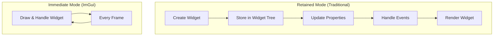
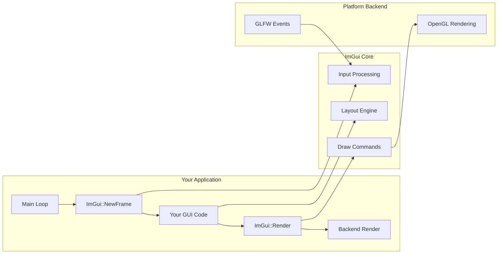
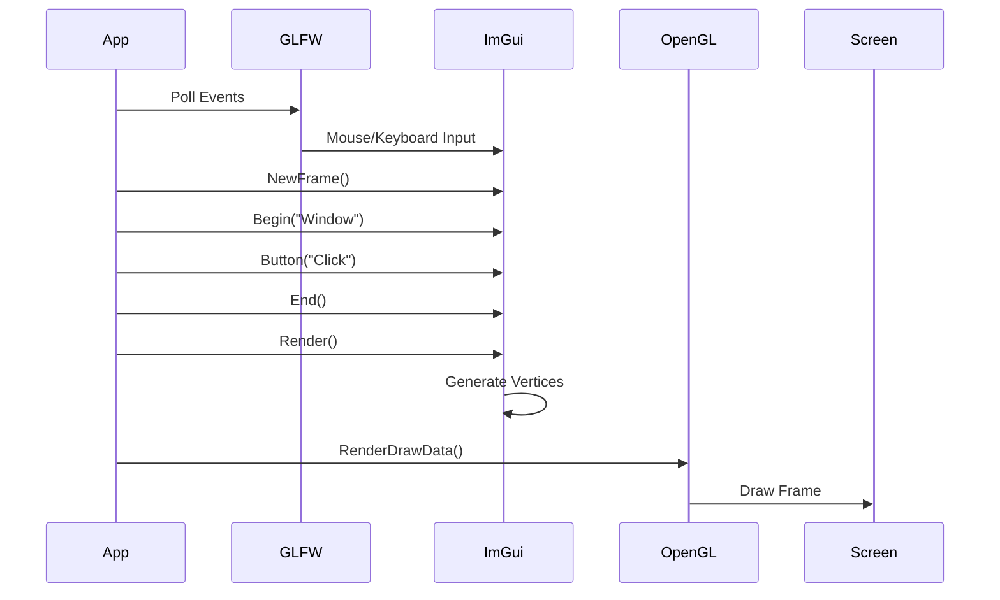

# ImGui Overview & Architecture

## What is Dear ImGui?

Dear ImGui is an immediate mode GUI library - fundamentally different from traditional retained mode GUIs (Qt, GTK, etc.).

### Immediate Mode vs Retained Mode



**Retained Mode:**
```cpp
// Create once
auto button = new QPushButton("Click me");
button->onClick([]{ handleClick(); });
// Framework manages lifetime, events, rendering
```

**Immediate Mode:**
```cpp
// Every frame
if (ImGui::Button("Click me")) {
    handleClick();  // Clicked THIS frame
}
// No objects, no callbacks, no cleanup
```

## Core Architecture



## Key Components

### 1. Context
Global state for one ImGui instance:
```cpp
ImGuiContext* ctx = ImGui::CreateContext();
ImGui::SetCurrentContext(ctx);
```

### 2. IO Structure
Input/output configuration:
```cpp
ImGuiIO& io = ImGui::GetIO();
io.ConfigFlags |= ImGuiConfigFlags_NavEnableKeyboard;
io.FontGlobalScale = 1.0f;  // For HiDPI
```

### 3. Style Structure
Visual configuration:
```cpp
ImGuiStyle& style = ImGui::GetStyle();
style.WindowRounding = 8.0f;
style.Colors[ImGuiCol_WindowBg] = ImVec4(0.1f, 0.1f, 0.1f, 0.95f);
```

### 4. Draw Lists
Low-level rendering primitives:
```cpp
ImDrawList* draw_list = ImGui::GetWindowDrawList();
draw_list->AddLine(p1, p2, IM_COL32(255, 0, 0, 255), 2.0f);
```

## Frame Flow



## Memory Model

ImGui manages its own memory:
- **Temporary allocations** reset each frame
- **Persistent state** in global context
- **No manual memory management** for widgets

```cpp
// This is safe - ImGui copies the string
const char* text = getTempString();
ImGui::Text("%s", text);
// 'text' can be freed after the call

// For IDs, "##" hides label part
ImGui::Button("Label##unique_id");
// Shows "Label", uses "Label##unique_id" for ID
```

## Platform Integration

Our setup uses:

### Window Backend (GLFW)
- Window creation
- Input events (mouse, keyboard)
- OpenGL context management

### Rendering Backend (OpenGL3)
- Vertex/index buffer management  
- Shader compilation
- Texture handling

### Integration Points
```cpp
// Setup
ImGui_ImplGlfw_InitForOpenGL(window, true);
ImGui_ImplOpenGL3_Init("#version 330");

// Per frame
ImGui_ImplOpenGL3_NewFrame();
ImGui_ImplGlfw_NewFrame();
ImGui::NewFrame();
// ... your GUI code ...
ImGui::Render();
ImGui_ImplOpenGL3_RenderDrawData(ImGui::GetDrawData());
```

## Performance Characteristics

### Advantages
- **Predictable CPU usage** - runs every frame
- **No hidden allocations** - memory usage is stable
- **Cache-friendly** - linear memory access
- **Minimal state** - no complex widget trees

### Considerations  
- **CPU bound** - all UI logic runs on CPU
- **No dirty rectangles** - redraws everything
- **String hashing** - IDs computed each frame
- **Immediate layout** - no caching of layout calculations

### Optimization Tips
```cpp
// Skip invisible windows
if (!ImGui::IsWindowVisible()) {
    ImGui::End();
    return;
}

// Use columns/tables for complex layouts
ImGui::BeginTable("table", 3);
// More efficient than manual positioning

// Reuse string buffers
static char buffer[256];
ImGui::InputText("##input", buffer, sizeof(buffer));
```

## Thread Safety

⚠️ **ImGui is NOT thread-safe!**

All ImGui calls must happen from the same thread:
```cpp
// WRONG
std::thread([]{
    ImGui::Text("This will crash!");
}).detach();

// RIGHT  
// Collect data in other threads
auto data = processInBackground();
// Display on main thread
ImGui::Text("Result: %s", data.c_str());
```

## Next Steps

- [Setup Guide →](setup.md) - Integration with GLFW/OpenGL
- [HiDPI & Scaling →](hidpi-scaling.md) - Critical for modern displays