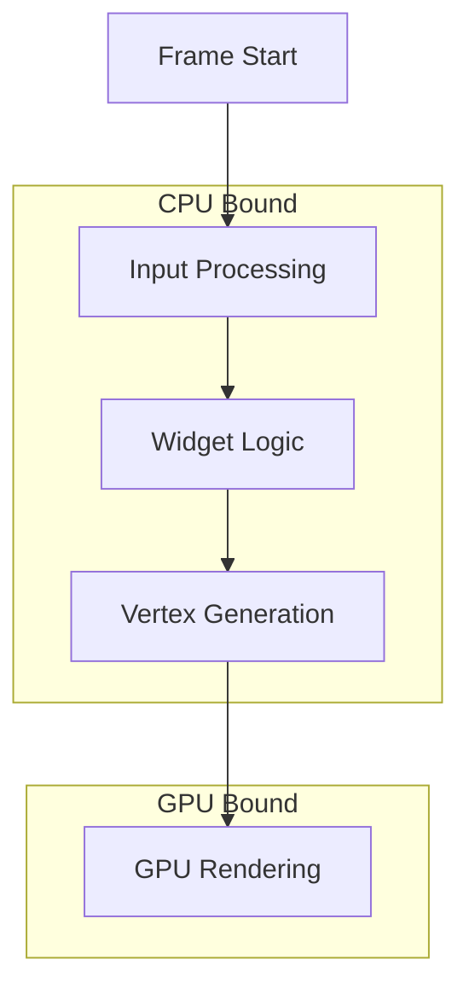

# ImGui Performance Optimization

## Performance Characteristics

ImGui is generally fast, but understanding its performance model helps optimize:



## Measurement & Profiling

### Built-in Metrics

```cpp
void showPerformanceMetrics() {
    ImGuiIO& io = ImGui::GetIO();
    
    // Basic metrics
    ImGui::Text("FPS: %.1f (%.3f ms/frame)", 
        io.Framerate, 1000.0f / io.Framerate);
    ImGui::Text("Vertices: %d", io.MetricsRenderVertices);
    ImGui::Text("Indices: %d", io.MetricsRenderIndices);
    ImGui::Text("Windows: %d", io.MetricsRenderWindows);
    
    // Detailed metrics window
    if (ImGui::Button("Show Metrics")) {
        show_metrics = !show_metrics;
    }
    
    if (show_metrics) {
        ImGui::ShowMetricsWindow(&show_metrics);
    }
}
```

### Custom Profiling

```cpp
class PerformanceProfiler {
private:
    struct Timer {
        std::chrono::high_resolution_clock::time_point start;
        double accumulated = 0.0;
        int count = 0;
    };
    
    std::unordered_map<std::string, Timer> timers;
    
public:
    void begin(const std::string& name) {
        timers[name].start = std::chrono::high_resolution_clock::now();
    }
    
    void end(const std::string& name) {
        auto& timer = timers[name];
        auto end = std::chrono::high_resolution_clock::now();
        auto duration = std::chrono::duration<double, std::milli>(
            end - timer.start).count();
        timer.accumulated += duration;
        timer.count++;
    }
    
    void render() {
        if (ImGui::Begin("Profiler")) {
            for (auto& [name, timer] : timers) {
                double avg = timer.count > 0 ? 
                    timer.accumulated / timer.count : 0.0;
                ImGui::Text("%s: %.3f ms", name.c_str(), avg);
            }
        }
        ImGui::End();
    }
};

// Usage
profiler.begin("UI Render");
renderComplexUI();
profiler.end("UI Render");
```

## Common Performance Issues

### 1. Too Many Draw Calls

**Problem**: Each window/popup creates a draw call
```cpp
// BAD: Many small windows
for (int i = 0; i < 100; i++) {
    ImGui::Begin(std::to_string(i).c_str());
    ImGui::Text("Item %d", i);
    ImGui::End();
}
```

**Solution**: Combine into single window
```cpp
// GOOD: One window with many items
ImGui::Begin("Items");
for (int i = 0; i < 100; i++) {
    ImGui::Text("Item %d", i);
}
ImGui::End();
```

### 2. Invisible Window Processing

**Problem**: Processing hidden windows
```cpp
// BAD: Always processing
ImGui::Begin("Debug");
for (int i = 0; i < 10000; i++) {
    ImGui::Text("Line %d", i);
}
ImGui::End();
```

**Solution**: Skip when not visible
```cpp
// GOOD: Early out
if (ImGui::Begin("Debug")) {
    // Only process if visible
    for (int i = 0; i < 10000; i++) {
        ImGui::Text("Line %d", i);
    }
}
ImGui::End();
```

### 3. Complex Calculations Every Frame

**Problem**: Recalculating data unnecessarily
```cpp
// BAD: Sorting every frame
std::vector<Item> items = getAllItems();
std::sort(items.begin(), items.end());
for (const auto& item : items) {
    ImGui::Text("%s", item.name.c_str());
}
```

**Solution**: Cache results
```cpp
// GOOD: Cache sorted data
static std::vector<Item> sorted_items;
static bool needs_sort = true;

if (needs_sort) {
    sorted_items = getAllItems();
    std::sort(sorted_items.begin(), sorted_items.end());
    needs_sort = false;
}

for (const auto& item : sorted_items) {
    ImGui::Text("%s", item.name.c_str());
}
```

## Optimization Techniques

### 1. Clipping & Culling

```cpp
// Manual clipping for large lists
void renderLargeList(const std::vector<Item>& items) {
    ImGuiListClipper clipper;
    clipper.Begin(items.size());
    
    while (clipper.Step()) {
        for (int i = clipper.DisplayStart; i < clipper.DisplayEnd; i++) {
            ImGui::Text("Item %d: %s", i, items[i].name.c_str());
        }
    }
    
    clipper.End();
}

// Custom culling
void renderWithCulling() {
    ImVec2 window_pos = ImGui::GetWindowPos();
    ImVec2 window_size = ImGui::GetWindowSize();
    
    for (const auto& object : objects) {
        // Check if object is in view
        if (object.pos.x < window_pos.x - object.size.x ||
            object.pos.x > window_pos.x + window_size.x ||
            object.pos.y < window_pos.y - object.size.y ||
            object.pos.y > window_pos.y + window_size.y) {
            continue;  // Skip off-screen objects
        }
        
        renderObject(object);
    }
}
```

### 2. Reduce String Operations

```cpp
// BAD: String formatting every frame
for (int i = 0; i < 1000; i++) {
    ImGui::Text("Value: %.2f%%", values[i] * 100.0f);
}

// GOOD: Pre-format or use simpler operations
static std::vector<std::string> formatted_values;
if (values_changed) {
    formatted_values.clear();
    for (float v : values) {
        char buf[32];
        snprintf(buf, 32, "Value: %.2f%%", v * 100.0f);
        formatted_values.push_back(buf);
    }
    values_changed = false;
}

for (const auto& str : formatted_values) {
    ImGui::TextUnformatted(str.c_str());  // Faster than Text()
}
```

### 3. Optimize Tables

```cpp
// Efficient large table rendering
void renderLargeTable() {
    if (!ImGui::BeginTable("LargeTable", 3, 
        ImGuiTableFlags_RowBg | ImGuiTableFlags_ScrollY,
        ImVec2(0, 300))) {
        return;
    }
    
    ImGui::TableSetupColumn("ID");
    ImGui::TableSetupColumn("Name");
    ImGui::TableSetupColumn("Value");
    ImGui::TableHeadersRow();
    
    // Use clipper for large datasets
    ImGuiListClipper clipper;
    clipper.Begin(rows.size());
    
    while (clipper.Step()) {
        for (int row = clipper.DisplayStart; row < clipper.DisplayEnd; row++) {
            ImGui::TableNextRow();
            ImGui::TableNextColumn();
            ImGui::Text("%d", rows[row].id);
            ImGui::TableNextColumn();
            ImGui::TextUnformatted(rows[row].name.c_str());
            ImGui::TableNextColumn();
            ImGui::Text("%.2f", rows[row].value);
        }
    }
    
    ImGui::EndTable();
}
```

### 4. Custom Rendering

```cpp
// Direct draw list manipulation for performance
void renderManyPoints(const std::vector<ImVec2>& points) {
    ImDrawList* draw_list = ImGui::GetWindowDrawList();
    
    // Reserve space
    draw_list->PrimReserve(points.size() * 6, points.size() * 4);
    
    const ImU32 col = IM_COL32(255, 255, 0, 255);
    const float size = 2.0f;
    
    // Batch render
    for (const auto& p : points) {
        // Manually add vertices for a small square
        ImVec2 p1(p.x - size, p.y - size);
        ImVec2 p2(p.x + size, p.y + size);
        draw_list->PrimRect(p1, p2, col);
    }
}
```

### 5. Conditional Rendering

```cpp
class ConditionalUI {
private:
    bool show_details = false;
    bool show_advanced = false;
    int detail_level = 0;
    
public:
    void render() {
        // Basic info always shown
        ImGui::Text("FPS: %.1f", ImGui::GetIO().Framerate);
        
        // Details only when requested
        if (ImGui::Button("Toggle Details")) {
            show_details = !show_details;
        }
        
        if (show_details) {
            renderExpensiveDetails();
        }
        
        // Level of detail
        ImGui::SliderInt("Detail Level", &detail_level, 0, 3);
        
        switch (detail_level) {
            case 0: renderMinimal(); break;
            case 1: renderNormal(); break;
            case 2: renderDetailed(); break;
            case 3: renderFull(); break;
        }
    }
};
```

## Memory Optimization

### String Memory

```cpp
// Avoid temporary strings
class StringCache {
private:
    std::unordered_map<int, std::string> cache;
    
public:
    const char* format(int id, const char* fmt, ...) {
        auto& str = cache[id];
        
        va_list args;
        va_start(args, fmt);
        
        // Resize if needed
        int size = vsnprintf(nullptr, 0, fmt, args) + 1;
        str.resize(size);
        
        va_start(args, fmt);
        vsnprintf(str.data(), size, fmt, args);
        va_end(args);
        
        return str.c_str();
    }
};

// Usage
StringCache str_cache;
ImGui::Text(str_cache.format(0, "Value: %.2f", value));
```

### Vertex Buffer Management

```cpp
// Pre-allocate for known sizes
void setupForLargeUI() {
    ImGuiIO& io = ImGui::GetIO();
    
    // Reserve vertex buffer space
    ImDrawList* draw_list = ImGui::GetBackgroundDrawList();
    draw_list->PrimReserve(10000, 30000);  // Indices, vertices
}
```

## Platform-Specific Optimizations

### GPU Optimizations

```cpp
// Reduce state changes
class BatchedRenderer {
    std::vector<ImDrawList*> draw_lists;
    
    void flush() {
        // Sort by texture to minimize state changes
        std::sort(draw_lists.begin(), draw_lists.end(),
            [](const ImDrawList* a, const ImDrawList* b) {
                return a->CmdBuffer[0].TextureId < b->CmdBuffer[0].TextureId;
            });
            
        // Render batched
        for (auto* list : draw_lists) {
            ImGui_ImplOpenGL3_RenderDrawData(list);
        }
    }
};
```

### Threading Considerations

```cpp
// Prepare data on worker threads
class ThreadedDataPreparer {
    std::vector<float> processed_data;
    std::mutex data_mutex;
    std::atomic<bool> data_ready{false};
    
    void prepareDataAsync() {
        std::thread([this]() {
            auto data = expensiveCalculation();
            {
                std::lock_guard<std::mutex> lock(data_mutex);
                processed_data = std::move(data);
            }
            data_ready = true;
        }).detach();
    }
    
    void render() {
        if (data_ready) {
            std::lock_guard<std::mutex> lock(data_mutex);
            for (float value : processed_data) {
                ImGui::Text("%.2f", value);
            }
        } else {
            ImGui::Text("Loading...");
        }
    }
};
```

## Checklist

### Performance Checklist
- [ ] Skip invisible window contents
- [ ] Use clipping for large lists
- [ ] Cache formatted strings
- [ ] Batch similar draw operations
- [ ] Minimize state changes
- [ ] Use `TextUnformatted()` when possible
- [ ] Profile before optimizing
- [ ] Test on target hardware

### Red Flags
- 🚩 FPS drops when opening specific windows
- 🚩 High vertex count (>100k)
- 🚩 Many draw calls (>100)
- 🚩 String formatting in inner loops
- 🚩 Creating widgets for off-screen items

## Next Steps

- [Troubleshooting →](troubleshooting.md) - Common issues and fixes